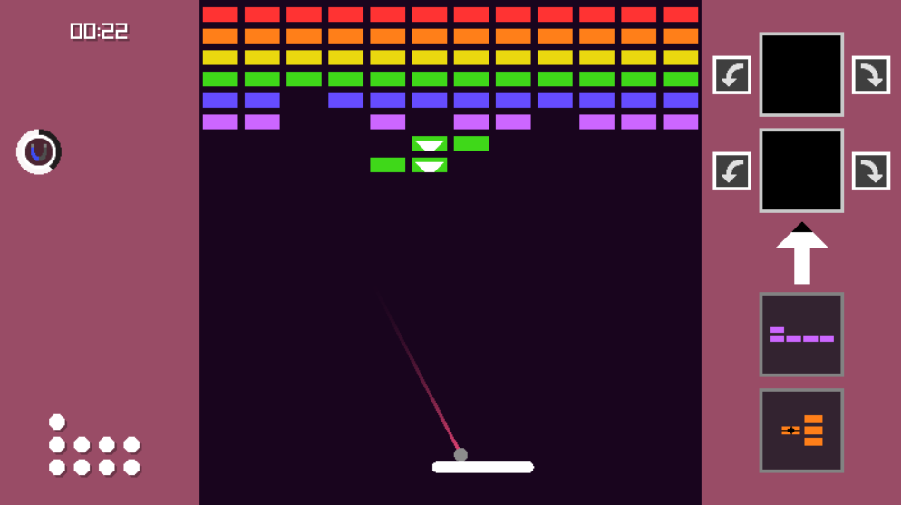

# Break-In
A 2 player asymmetrical variation of the breakout game made with Raylib. One player plays as the paddle and the other as the bricks.

Play it here: https://pered.itch.io/break-in

Details:
- About 3800 lines of code.
- The graphics I made myself and the sound effects are mostly free sounds from the internet.

To compile:
- Learn how to compile Raylib for web.
- Then you can use the build.bat I provide if you want.

(November 2022)
